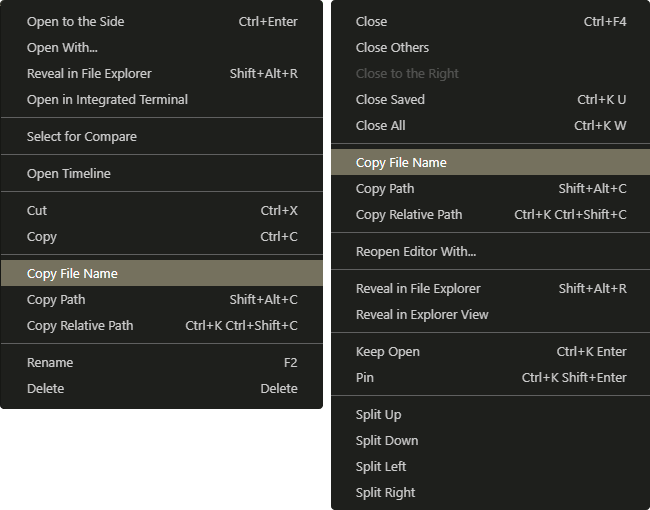
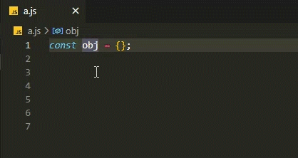
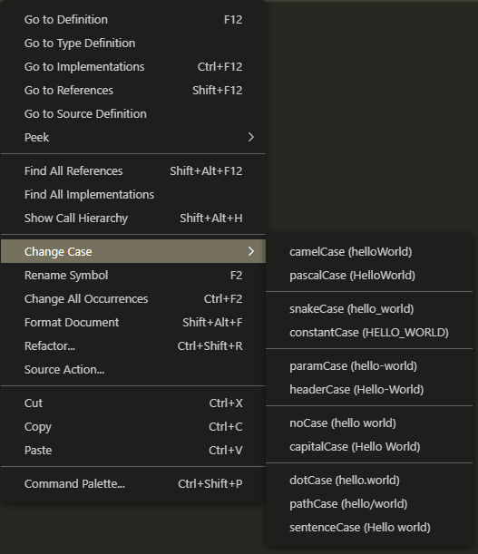
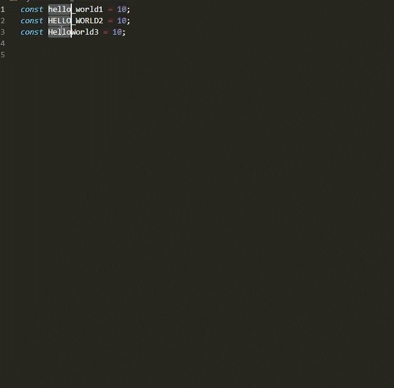

### Use concise code completion, using ES6 and minus redundant code.

**Contains features:**

- Copy File Name
- Quickly Print `console.log` (keyboard shortcuts: `ctrl+shift+l`)
- Change Case

**Copy File Name**

file context menu and tab context menu.



**Quickly Print `console.log`**

key: `ctrl+shift+l`



**Configuration**

Print a semicolon at the end of console.log.

```json
"quickConsoleLog.semicolon": true
```

**Change Case**

Powered with [change-case](https://github.com/blakeembrey/change-case).




**Supports multiple cursors.**




**copy filename code**

```js
vscode.commands.registerCommand('copyFilename', fs => {
  vscode.env.clipboard.writeText(fs.path.split('/').at(-1));
});
```

**print console.log code**

```js
vscode.commands.registerCommand('quickConsoleLog', () => {
  const editor = vscode.window.activeTextEditor;
  const selectedText = editor.document.getText(editor.selection).trim();
  selectedText
    ? vscode.commands.executeCommand('editor.action.insertLineAfter').then(() => {
        editor.insertSnippet(new vscode.SnippetString(`console.log('${selectedText}', ${selectedText});`));
      })
    : editor.insertSnippet(new vscode.SnippetString(`console.log($0);`));
});
```

**change case code**

```js
[
  'camelCase',
  'capitalCase',
  'constantCase',
  'dotCase',
  'headerCase',
  'noCase',
  'paramCase',
  'pascalCase',
  'pathCase',
  'sentenceCase',
  'snakeCase',
].map(v =>
  vscode.commands.registerCommand(v, () => {
    const editor = vscode.window.activeTextEditor;
    editor.selections.forEach(t => {
      const selectedText = editor.document.getText(t);
      selectedText &&
        editor.insertSnippet(new vscode.SnippetString(`${changeCase[v](selectedText)}`), new vscode.Range(t.start, t.end));
    });
  })
);
```
