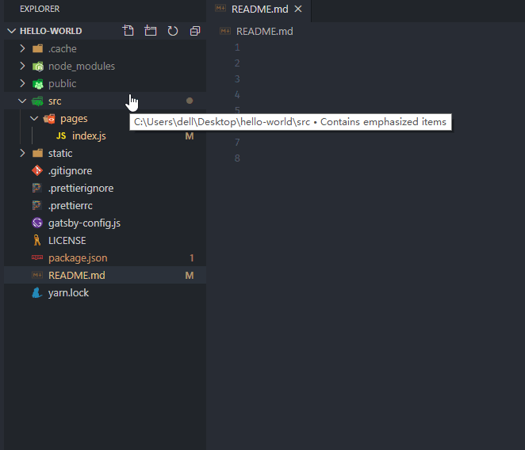

# copy-file-name

#### Used to quickly copy file or folder names on directories or tabs

I just added a few lines of code based on [Copy filename](https://marketplace.visualstudio.com/items?itemName=jack89ita.copy-filename).

Before this: `index.html`

Now it is: `index`

